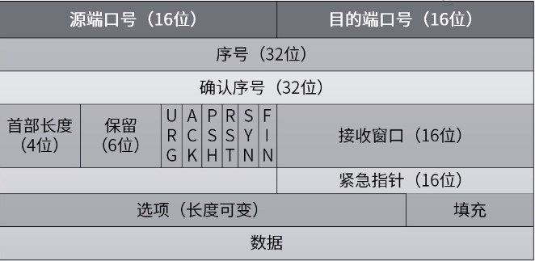
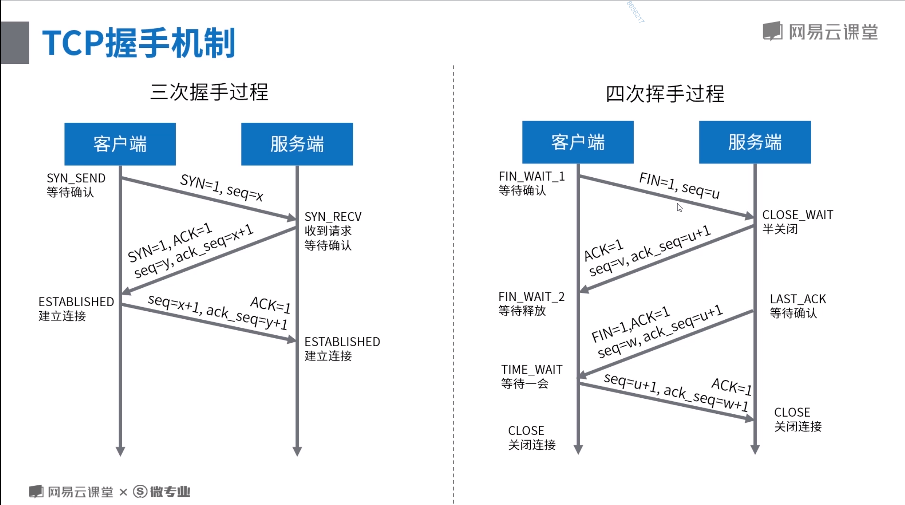
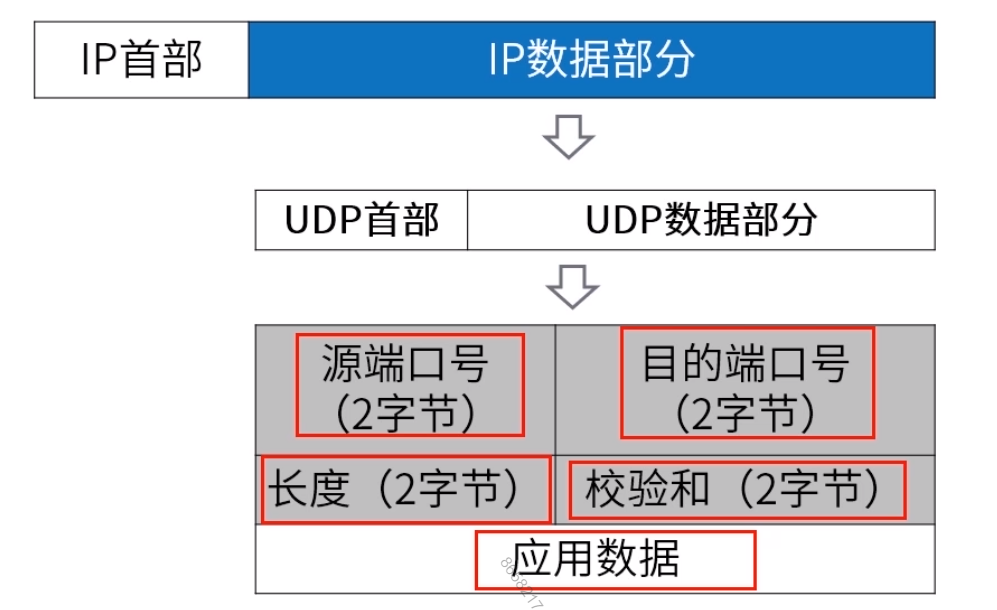

# **Java高级-初来乍到-单节点系统**

## **第三章 应用服务器优化**

### **第三节 Tomcat 容器优化**

#### **3.3.1 TCP/UDP 协议**

##### **OSI 网络七层模型**

为是不同计算机厂家的计算机能够互相通信，以便在更大的范围内建立计算机网络，有必要建一个国际范围的网络体系结构标准。

##### **各层的主要功能**

###### 低三层

* 物理层
  * 是原始的的数据比特流能在物理介质上传输
* 数据链路层
  * 通过体检、确认和反馈重发等手段，形成稳定的数据链路。（01010101）。
* 网络层
  * 进行路由选择和流量控制。（IP协议）

传输层：提供可靠的端口和端口的数据传输服务（TCP、UDP）。

* 会话层
  * 负责建立、管理和终止进程之间的会话和数据交换。
* 表示层
  * 负责数据格式转换、数据加密与解密、压缩与解压缩等。
* 应用层
  * 位用户的应用进程提供网络服务。

##### **传输控制协议 TCP**

传输控制协议（TCP）是Internet一个重要的传输层协议。TCP提供面向连接、可靠、有序、字节流传输服务。应用程序在使用TCP之前，必须先建立TCP连接。

##### **TCP 握手机制**

##### 用户数据报协议 UDP

用户数据报协议 UDP 是 Internet 传输层协议。提供无连接、不可靠、数据报尽力传输服务。

开发应用人员在UDP上构建应用，关注以下几点：

1. 应用进程更容易控制发送什么数据以及何时发送
2. 无需建立连接
3. 无连接状态
4. 首部开销小

##### UDP 和 TCP 比较

|      TCP       |    UDP     |
| :------------: | :--------: |
|    面向连接    |   无连接   |
| 提供可靠性保证 |   不可靠   |
|       慢       |     快     |
|   资源占用多   | 资源占用少 |

##### 什么情况下用到UDP？

音视频聊天

##### Socket编程

* Internet中应用最管饭的网络应用编程接口，实现与3中底层协议接口：
  * 数据报类型套接字SOCK_DGRAM（面向UDP接口）
  * 流式套接字SOCK_STREAM（面向TCP接口）
  * 原始套接字SOCK_RAW（面向网络层协议接口IP、ICMP等）
* 主要Socket API 及其调用过程
  * 创建套接字:arrow_right:端点绑定:arrow_right:发送数据:arrow_right:接收数据:arrow_right:释放套接字
* Socket API 函数定义
  * listen()、accept()函数只能用于服务器端；
  * connect()函数只能用户客户端；
  * socket()、bind()、send()、recv()、sendto()、rescfrom()、close()

#### 3.3.2 BIO 网络编程

#### 3.3.3 NIO 网络编程

#### 3.3.4 Tomcat 网络处理线程模型

#### 3.3.5 Tomcat 参数调优

